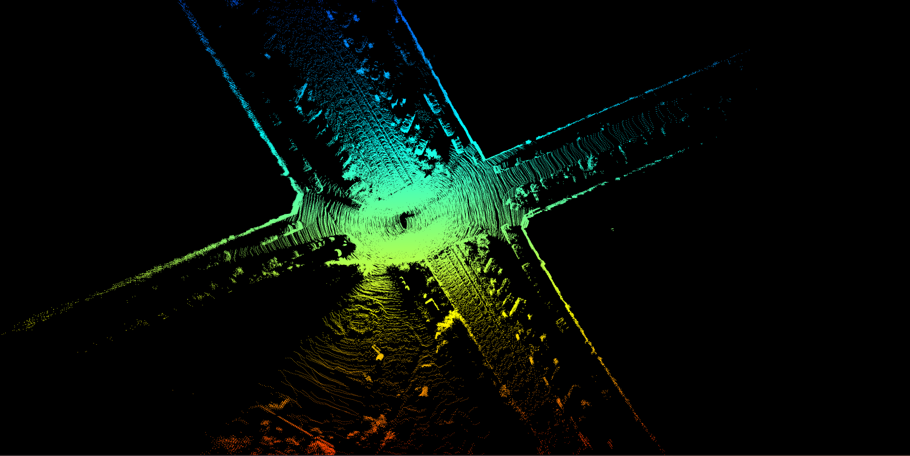

# open3d_graph_slam
## Dataset download
[Scenario 1](https://www.mrt.kit.edu/z/publ/download/velodyneslam/data/scenario1.zip)  
[Scenario 2](https://www.mrt.kit.edu/z/publ/download/velodyneslam/data/scenario2.zip)

## Convert kit dataset to pcd
unzip scenario1 to '/home/koide/datasets/kit/scenario1'
```bash
python generate_pcd.py
```

## Mapping
```bash
python slam.py
```

## Result

